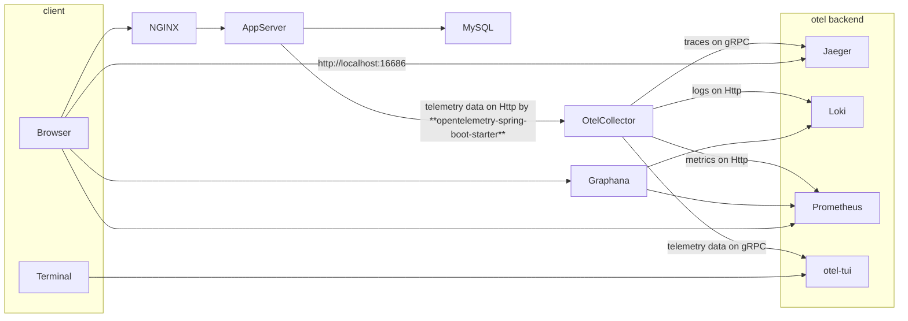

# spring-html-demo
## build & launch App server
```bash
./mvnw clean package && docker compose up 
```

And then you can access to `http://localhost/todo` by your browser.
Your request is handled by Nginx and forwarded to the Spring Boot server.

## Architecture Overview


## Otel Backends
### Trace (Jaeger)
open `http://localhost:16686` in your browser.

### log  (Loki + Grafana)
open `http://localhost:3000` in your browser.
And login with `admin`/`admin`.

Configure Loki from `http://localhost:3000/connections/datasources/new`.
And then you can query logs from `http://localhost:3000/explore`.

### Metrics (Prometheus)
open `http://localhost:9090` in your browser.
And query target metrics.

### Trace, Log, Metrics (otel-tui)
https://github.com/ymtdzzz/otel-tui

```bash
$ docker compose attach oteltui
```
